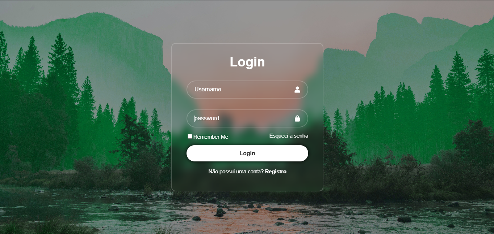

# 🔐 Login Page (Glassmorphism)

Projeto de uma tela de login moderna com efeito glassmorphism, desenvolvida com HTML, CSS e JavaScript.

## 🚧 Status
Em desenvolvimento (validação será implementada)

## ✨ Funcionalidades
- Interface de login moderna
- Efeito glassmorphism (blur + transparência)
- Layout centralizado e responsivo
- Inputs com ícones
- Botão de login estilizado

## 🛠 Tecnologias
- HTML5
- CSS3
- JavaScript

## 📌 Objetivo
Praticar criação de interfaces modernas e melhorar habilidades em front-end.

## 🚀 Próximos passos
- [x] Validação de login com JavaScript
- [x] Mensagens de erro personalizadas
- [ ] Redirecionamento para nova página

## 🔑 Acesso para teste

Este projeto utiliza uma autenticação simples para fins de estudo.

Credenciais:
- Usuário: Lucas  
- Senha: 12345678

## 📷 Preview

